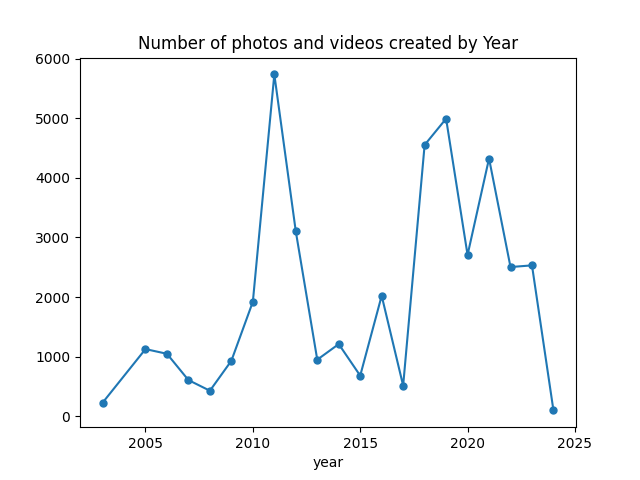

**Project name: PFP - Personal Files on Premise**

**Project goal:** Efficient way to back personal files on locally on premise. Ideally on an external disk: HDD or SDD.

***Background story:*** Told my son that I have all the family photos safe in the cloud. Amazon Photos. His question was, "if somethign happens to you, would I be able to down it?". 
I am not absolutely sure on that answers. So I thought I should download all of the files from Amazon and store them 
ordered by some cronological format. I have decided to use year/month format.

**Challenges**

_Ethical & Social_

1. What happens to your files on cloud if you die? Same applies to social media accounts? Should your spouse or child have access to them? 
2. What happens if you miss to pay your monthly or yearly fee to maintain the cloud account? Typically, you loose all your asset on that cloud account. oouch!!

_Technical_

1. _Duplicate files:_
Some of the files are duplicated in Amazon as they have been backed up from multiple devices. 
And when I copy it down, I want only a single copy. So I am using the checksum of the file and the file size as the 
file's signature to ensure they are unique. 
2. _Files with same name:_
As I had backup files from various devices, some of the files have the same name and also the year and month of creation
but they aren't the same. Using the above signature I have copyied in the same destination by using the signature as part of the new file name
3. _Efficient copy:_ Periodically when I rerun the program, it should only identify new files that aren't in PFP yet
and copy them. For this, we are keeping track of all the files in PFP that has the file signature and the other file metadata.
If the new file signature matches to prior ones, it will skip the copy.
4. _Missing media meta data:_ Many of the photos and video have different format and some of them were strip out when 
they were sent via social media and accross the years, standard have also changed. So the program makes the best attemp 
to find the time when the media was created. If it is not able to use the media meta data, it will try to use the file name 
pattern as many of the images had timestamp in the file. If all fails, it will detaul to 1111/11/11 so that it would be identified easily in the future.

_Software required:_
   1. Python program installation
   2. Install ffmpeg. https://phoenixnap.com/kb/ffmpeg-windows

_Tested_

1. The program was tested on about 80,000 files that took up 120GB. 
  

**Steps to run on your local PC**
1. Ensure Python and ffmpeg are installed and they are in your PATH. 
2. Verify by starting up a command prompt and check the versions for both.
3. Down the file foss.py
4. Run `python foss input_root_dir  output_root_dir`

Optional:
1. If you are interested the number of photos or videos create by year run the program
2. Run `python PlotPhotoByDate`

_Disclaimer_

New to python programming. Feel free to change the program and make a pull request. 
Appreciate any effort to make it better. 

_License_
Jakarta License
