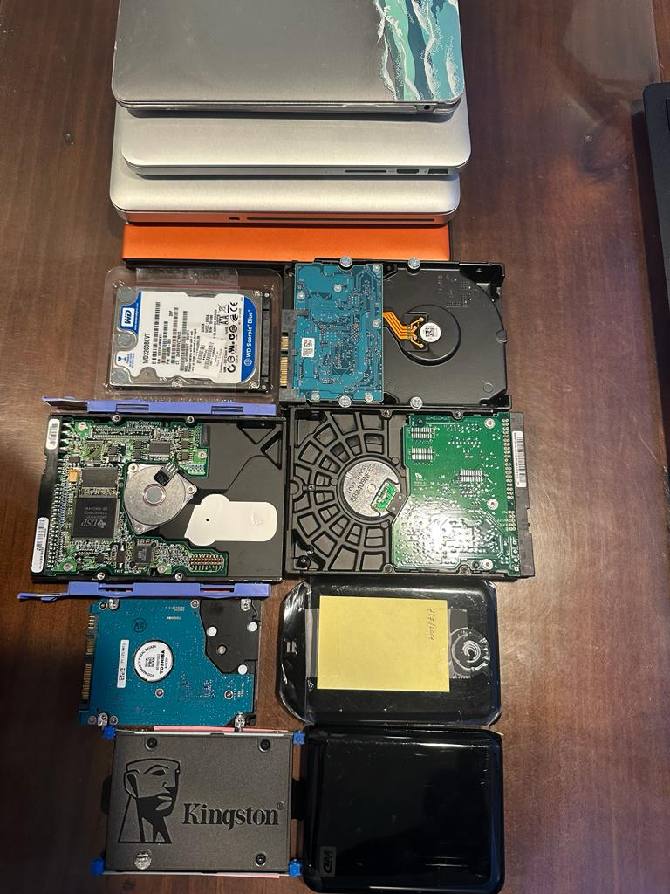

**Project name: PFP - Personal Files on Premise**

**Project goal:** Efficient way to backup personal files locally on-premise. Ideally, on an external disk: HDD or SDD.

***Background story:*** Told my son that I have all the family photos safe in the cloud. Amazon Photos. His question was,
"If something happens to you, would I be able to down it?". 
I am still trying to figure out the answers. To begin with, I decided to download all the files from Amazon and store them 
chronologically. I have decided to use the year/month format.

**Challenges**

_Ethical & Social_

1. What happens to your files on the cloud if you die? Does the same apply to social media accounts? Should your spouse or child have access to them? 
2. What happens if you miss to pay your monthly or yearly fee to maintain the cloud account? Typically, you lose all your assets on that cloud account. oouch!!

_Technical_

1. _Duplicate files:_
Some files are duplicated in Amazon as they have been backed up from multiple devices. 
And when I copy it down, I want only a single copy. So, I am using the checksum of the file and the file size as the 
file's signature to ensure they are unique. 
2. _Files with same name:_
As I had backup files from various devices, some files have the same name and the year and month of creation
but they are different. Using the above signature, I have copied in the same destination by using the signature as part of the new file name.
3. _Efficient copy:_ Periodically, when I rerun the program, it should only identify new files that aren't in PFP yet
and copy them. For this, we keep track of all the files in PFP with the file signature and the other file metadata.
If the new file signature matches the prior ones, it will skip the copy.
4. _Missing media metadata:_ Many photos and videos have different formats; some were stripped out when 
sent via social media, and standards have also changed over the years. So, the program makes the best attempt 
to find the time when the media was created. If it cannot use the media metadata, it will try using the file name 
pattern, as many images had timestamps. If all fails, it will be detailed to 1111/11/11 so it can be easily identified.

_Software required:_
   1. Python program installation
   2. Install ffmpeg. https://phoenixnap.com/kb/ffmpeg-windows

_Tested_

1. The program was tested on about 80,000 files that took up 120GB. 
  

**Steps to run on your local PC**
1. Ensure Python and ffmpeg are installed and in your PATH. 
2. Verify by starting up a command prompt and checking both versions.
3. Down the file foss.py
4. Run `python foss input_root_dir  output_root_dir`

Optional:
1. If you are interested in the number of photos or videos created by year run the program
2. Run `python PlotPhotoByDate`

_Disclaimer_

New to Python programming. Feel free to change the program and make a pull request. 
I appreciate any effort to make it better. 

_License_
Jakarta License